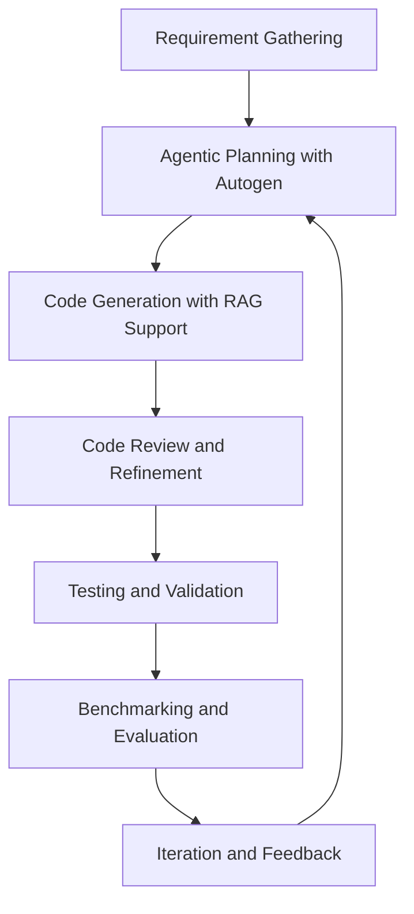

# Architecture Document for the COBOLGen Benchmark Pilot

## Table of Contents

1. [Introduction](#introduction)
2. [Project Overview](#project-overview)
3. [Architectural Components](#architectural-components)
   - [Autogen Framework (Agentic AI)](#autogen-framework-agentic-ai)
   - [Retrieval-Augmented Generation (RAG)](#retrieval-augmented-generation-rag)
   - [Large Language Models (LLMs)](#large-language-models-llms)
   - [Knowledge Base for RAG](#knowledge-base-for-rag)
   - [Python Development Environment](#python-development-environment)
   - [Cloud-Based Infrastructure](#cloud-based-infrastructure)
   - [Version Control and Collaboration](#version-control-and-collaboration)
   - [Testing and Validation Frameworks](#testing-and-validation-frameworks)
   - [Documentation and Reporting Tools](#documentation-and-reporting-tools)
4. [Architectural Workflow](#architectural-workflow)
5. [Data Flow Diagram](#data-flow-diagram)
6. [Security and Compliance](#security-and-compliance)
7. [Scalability and Performance Considerations](#scalability-and-performance-considerations)
8. [Conclusion](#conclusion)

---

## Introduction

This document outlines the architecture for the COBOLGen Benchmark Pilot project, which aims to develop synthetic COBOL datasets for benchmarking the performance of large language models (LLMs) in translating COBOL programs to modern languages.

## Project Overview

The project leverages AI frameworks, cloud infrastructure, and collaboration tools to automate the generation of synthetic COBOL projects. The goal is to simulate a team of AI agents that plan, code, review, and integrate complex COBOL applications.

## Architectural Components

### Autogen Framework (Agentic AI)

- **Description:** Automates the generation and collaboration of a team of AI agents. Design will address the structure of the Autogen framework and the specific Autogen agents that will be used.
- **Technologies Used:** Link to Autogen framework: https://github.com/microsoft/autogen. This repository will be forked and used locally.

### Retrieval-Augmented Generation (RAG)

- **Description:** Enhances code generation by providing context from existing COBOL codebases and domain-specific knowledge.
- **Technologies Used:** Combines large language models with a retrieval system. Autogen includes RAG as a feature and will be used in the implementation.

### Large Language Models (LLMs)

- **Description:** Used for generating and refining COBOL code, and assisting in translating COBOL to modern languages.
- **Technologies Used:** OpenAI o1-preview will be used for the agents with the most abstract and high-level planning functions. GPT4o will be used for agents with narrower more specific generation tasks.

### Knowledge Base for RAG

- **Description:** Serves as the contextual database for RAG, containing COBOL syntax, semantics, and best practices.
- **Technologies Used:** To include at least the GNUCobol Sample Programs and whatever additional sources are relevant to the COBOL language and its idioms. Also should include summaries of the syntax and semantics of Cobol

### Python Development Environment

- **Description:** Develops and hosts Autogen agents, orchestrates interactions between components.
- **Technologies Used:** Python 3.x, `pipenv` or `poetry`., Cursor AI will be used for code generation. v0 will be used when UI code is being designed as it specializes int that

### Cloud-Based Infrastructure

- **Description:** Provides scalable computing resources for running Autogen agents and managing datasets.
- **Technologies Used:** The OpenAI API will be used to host the model. The python application will be containerized using Docker and orchestrated using Kubernetes so that after running locally it can be containerized and run in a cloud environment.

### Version Control and Collaboration

- **Description:** Manages codebase, tracks changes, and facilitates team collaboration.
- **Technologies Used:** GitHub, Git.

### Testing and Validation Frameworks

- **Description:** Ensures the correctness and quality of generated COBOL code.
- **Technologies Used:** `pytest`, CI/CD pipelines, initially COBOL will be evaluated by humans but tests should be written to evaluate the quality of the cobol code after translation to allow for future evaluation by AI systems.

### Documentation and Reporting Tools

- **Description:** Creates, maintains, and publishes project documentation.
- **Technologies Used:** Markdown, MkDocs or Sphinx.

## Architectural Workflow

1. **Requirement Gathering:** Inputs from human experts in JSON/YAML format detailing business requirements and COBOL features.
2. **Agentic Planning with Autogen:** AI agents interpret requirements, plan project scope, and assign tasks.
3. **Code Generation with RAG Support:** Agents generate COBOL code, utilizing RAG to fetch relevant context.
4. **Code Review and Refinement:** Agents perform iterative reviews, leveraging LLMs to improve code quality.
5. **Testing and Validation:** Automated testing frameworks validate the correctness of the generated code.
6. **Benchmarking and Evaluation:** The synthetic COBOL datasets are used to benchmark LLM translation tools.
7. **Iteration and Feedback:** Results inform further refinement of the agents and code generation process.

## Data Flow Diagram

[Include and reference any architectural diagrams that illustrate system interactions.]

## Security and Compliance

- **Data Security:**

  - **In Transit:** All data transmitted between the client and server, including business requirements and generated COBOL code, will be encrypted using TLS (Transport Layer Security) to ensure secure communication.
  - **At Rest:** Generated COBOL code and any other sensitive data stored on the server will be encrypted using industry-standard encryption algorithms (e.g., AES-256) to protect against unauthorized access.

- **Access Control:**

  - **Authentication:** Implement a robust authentication mechanism to ensure that only authorized users can access the system. This could include multi-factor authentication (MFA) for added security.
  - **Authorization:** Define and enforce user roles and permissions to control access to different parts of the system. Ensure that users can only perform actions that are necessary for their role.

- **Compliance Standards:**

  - **GDPR:** If the system processes personal data of EU citizens, ensure compliance with the General Data Protection Regulation (GDPR) by implementing data protection measures and providing users with control over their data.
  - **HIPAA:** If applicable, ensure compliance with the Health Insurance Portability and Accountability Act (HIPAA) by safeguarding any health-related information.
  - **Data Retention Policies:** Establish clear data retention policies to ensure that data is stored only as long as necessary and is securely deleted when no longer needed.

- **Secure Downloads:**

  - Ensure that all downloads of generated COBOL code are conducted over secure connections using HTTPS to prevent interception or tampering during transmission.

- **Regular Security Audits:**

  - Conduct regular security audits and vulnerability assessments to identify and address potential security risks. Implement a process for timely patching and updating of software components.

- **Incident Response Plan:**
  - Develop and maintain an incident response plan to quickly and effectively respond to any security breaches or incidents. This should include procedures for notification, containment, eradication, and recovery.

## Scalability and Performance Considerations

- **Scalability Strategies:**

  - **Cloud Infrastructure:** Leverage cloud-based services (e.g., AWS, Azure, Google Cloud Platform) to dynamically allocate resources based on demand. This includes using auto-scaling groups for compute resources to handle varying workloads efficiently.
  - **Containerization:** Utilize Docker containers to package and deploy applications consistently across different environments. This allows for easy scaling by adding more container instances as needed.
  - **Microservices Architecture:** Consider breaking down the system into smaller, independent services that can be scaled individually. This approach allows for more granular control over resource allocation and scaling.
  - **Load Balancing:** Implement load balancers to distribute incoming requests evenly across multiple instances, ensuring no single instance is overwhelmed and improving overall system reliability.

- **Performance Optimization:**
  - **Efficient Code Generation:** Optimize the code generation process by using efficient algorithms and data structures. This can reduce the time and resources required to generate COBOL code.
  - **Caching Mechanisms:** Implement caching strategies to store frequently accessed data and reduce the need for repeated computations or data retrievals. This can significantly improve response times.
  - **Asynchronous Processing:** Use asynchronous processing for tasks that do not require immediate completion, such as batch processing of large datasets. This can free up resources for more critical tasks.
  - **Monitoring and Profiling:** Continuously monitor system performance and use profiling tools to identify bottlenecks. Regularly analyze performance metrics to make informed decisions about optimizations and scaling.
  - **Database Optimization:** If a database is used, ensure that it is optimized for performance with proper indexing, query optimization, and regular maintenance tasks like vacuuming and defragmentation.

This section outlines initial strategies and techniques to ensure that the system can handle increased demand and maintain optimal performance as the pilot evolves into a full-fledged product. These considerations will help in planning for future growth and ensuring a robust and responsive system.

## Conclusion

This architecture document provides a comprehensive overview of the technology stack and workflow for the COBOLGen Benchmark Pilot project. It serves as a foundation for the implementation phase, ensuring alignment and efficiency.
