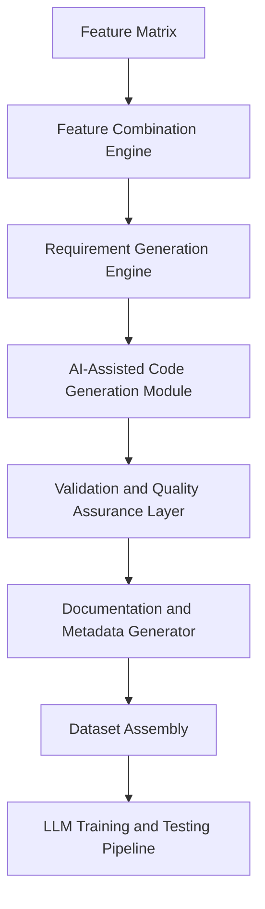

# Architecture Document for the COBOLGen Benchmark Pilot

## Introduction

This document outlines the architecture for the **COBOLGen Benchmark Pilot** project, which aims to create a comprehensive library of synthetic, non-trivial COBOL programs. These programs are designed to systematically cover all COBOL language features and mainframe capabilities, facilitating the training and testing of large language models (LLMs) for COBOL-to-modern-language translation.

---

## Architectural Components

### Feature Matrix and Combination Engine

- **Description**: A core component that maintains a comprehensive list of COBOL language features, mainframe capabilities, and application domains. It systematically generates valid combinations of these features to ensure full coverage across the generated programs.
- **Technologies Used**: Python scripts for managing the Feature Matrix and generating combinations; data storage solutions (like CSV, JSON, or databases) for managing feature data.

### Requirement Generation Engine

- **Description**: Automates the creation of detailed requirement specifications based on the feature combinations. Uses templates and prompt engineering to guide AI models in generating realistic business scenarios.
- **Technologies Used**: Python scripting, template libraries (e.g., Jinja2), integration with AI language models for enriching requirements.

### AI-Assisted Code Generation Module

- **Description**: Utilizes AI models to generate COBOL code that fulfills the detailed requirements. Ensures that the generated code is coherent, functional, and reflective of real-world business logic.
- **Technologies Used**: Integration with advanced AI language models (e.g., OpenAI GPT-4), prompt engineering techniques, API interfaces.

### Validation and Quality Assurance Layer

- **Description**: Implements automated validation processes to ensure the syntactic and functional correctness of the generated COBOL programs. Includes optional execution of programs with test data and human-in-the-loop reviews.
- **Technologies Used**: COBOL compilers/interpreters (e.g., GnuCOBOL) for syntax checking, testing frameworks (like pytest-cobol), automated scripts for batch validation.

### Documentation and Metadata Generator

- **Description**: Produces accompanying documentation and metadata for each generated program, detailing the included features, usage instructions, and annotations within the code.
- **Technologies Used**: Scripting tools for metadata generation, documentation frameworks like Sphinx or MkDocs.

### Python Development Environment

- **Description**: Serves as the primary development environment for scripting and orchestrating the various components of the system.
- **Technologies Used**: Python 3.x, package managers like `pipenv` or `poetry`, IDEs like VSCode with extensions for Python and COBOL, Cursor AI for code assistance.

### Large Language Models (LLMs)

- **Description**: Employed for generating detailed requirements and COBOL code based on prompts. They help ensure that the generated code is realistic and incorporates specified features.
- **Technologies Used**: OpenAI GPT-4 accessed via API, with appropriate handling of API keys and usage limits.

### Version Control and Collaboration

- **Description**: Manages the codebase, tracks changes, and facilitates collaboration during development.
- **Technologies Used**: Git for version control, GitHub for repository hosting, issue tracking, and collaboration features.

### Testing and Validation Frameworks

- **Description**: Tools and frameworks used to validate the syntactic and functional correctness of the generated COBOL code.
- **Technologies Used**: GnuCOBOL compiler for syntax checking, custom scripts for automated testing, potential use of continuous integration (CI) tools like GitHub Actions.

### Documentation and Reporting Tools

- **Description**: Used to create and maintain project documentation, as well as generate metadata and annotations for the generated code.
- **Technologies Used**: Markdown for documentation, Sphinx or MkDocs for generating documentation sites, Jupyter Notebooks for exploratory analysis.

### Cloud-Based Infrastructure (Optional)

- **Description**: Provides scalable computing resources for handling large-scale code generation tasks if local resources are insufficient.
- **Technologies Used**: Cloud services like AWS (EC2, Lambda), Azure, or Google Cloud Platform for scalable compute resources.

---

## Architectural Workflow

1. **Feature Matrix Development**: Maintain a comprehensive Feature Matrix listing COBOL language features, mainframe capabilities, and application domains.

2. **Systematic Feature Combination**: Use a combination engine to generate valid combinations of features, ensuring systematic coverage without redundancy.

3. **Automated Requirement Generation**: For each feature combination, generate detailed requirement specifications using templates and AI assistance.

4. **AI-Assisted Code Generation**: Utilize AI models to generate COBOL code based on the detailed requirements, ensuring inclusion of specified features.

5. **Validation and Quality Assurance**:

   - **Syntactic Validation**: Use COBOL compilers to check for syntax errors.
   - **Functional Testing**: Optionally execute programs with test data to verify functionality.
   - **Human Review**: Perform manual reviews on a subset of programs for quality assurance.

6. **Documentation and Metadata Creation**: Generate metadata and documentation for each program, detailing features included, usage instructions, and annotations.

7. **Dataset Assembly**: Organize the generated programs and documentation into a structured dataset suitable for LLM training and testing.

8. **Iteration and Feedback**: Use insights from validation and testing to refine the generation process, updating templates and prompts as needed.

---

## Data Flow Diagram

```mermaid
flowchart TD
    A[Feature Matrix] --> B[Feature Combination Engine]
    B --> C[Requirement Generation Engine]
    C --> D[AI-Assisted Code Generation Module]
    D --> E[Validation and Quality Assurance Layer]
    E --> F[Documentation and Metadata Generator]
    F --> G[Dataset Assembly]
    G --> H[LLM Training and Testing Pipeline]
```

---

## Security and Compliance

- **Data Security**:

  - **API Keys Protection**: Secure storage of API keys and credentials using environment variables or secret management tools.
  - **Data Encryption**: Use encryption for sensitive data at rest and in transit, especially if deploying on cloud infrastructure.

- **Access Control**:

  - **Authentication and Authorization**: Implement access controls if a user interface is developed, ensuring only authorized users can initiate code generation processes.

- **Compliance Standards**:

  - **Ethical Use of AI**: Adhere to the terms of service of AI models used, avoiding disallowed content and respecting usage policies.
  - **Data Privacy**: Ensure that no proprietary or personal data is included in the generated code.

- **Regular Audits**:
  - **Security Audits**: Periodically review the system for security vulnerabilities.
  - **Usage Monitoring**: Monitor API usage to prevent abuse and manage costs.

---

## Scalability and Performance Considerations

- **Scalability Strategies**:

  - **Parallel Processing**: Implement parallel execution of code generation and validation tasks to improve throughput.
  - **Efficient Resource Utilization**: Optimize code to minimize unnecessary API calls and manage computational resources effectively.
  - **Cloud Integration**: Leverage cloud services for on-demand scaling if local resources are insufficient.

- **Performance Optimization**:

  - **Caching Mechanisms**: Cache results of expensive operations where possible to reduce redundant processing.
  - **Asynchronous Operations**: Use asynchronous programming models to handle I/O-bound operations efficiently.
  - **Batch Processing**: Group similar tasks to reduce overhead and improve processing efficiency.

- **Monitoring and Logging**:
  - Implement monitoring tools to track system performance metrics.
  - Use logging to record processing times, errors, and resource utilization for ongoing optimization.

---

## Conclusion

This updated architecture document reflects our new approach to systematically generating a comprehensive library of synthetic COBOL programs. By combining programmatic feature combination, AI-assisted code generation, and robust validation processes, we aim to create valuable datasets that will facilitate the training and testing of LLMs for COBOL-to-modern-language translation.

This architecture emphasizes scalability, security, and maintainability, ensuring that the system can efficiently handle the generation of large datasets while adhering to best practices in software development and AI ethics.
